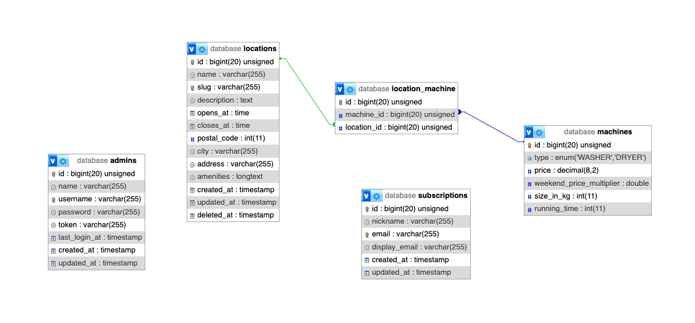

# Module A - Backend

In this module, you will create multiple **API endpoints** accessible at the base URL: `https://module-a-Y.sudsy.com/api/v1` where `Y` is your workstation number. The backend will serve data to both:

- The **admin application** used by employees.
- The public-facing **web application** showcasing Sudsy’s services and locations.

Your backend should listen on port `80`. In the deployed environment, our server infrastructure will **automatically enforce HTTPS**.

**Database Information**

- The backend uses a **MySQL** database for data storage.
- It can be accessed at `db.sudsy.com`, using port `3306` with the provided credentials.
- The database name follows the format: `competitor-Y`, where `Y` is your workstation number.

The database is currently empty. Use the given SQL dump in [`assets/module-a/db.sql`]('./assets/module-a/db.sql) to import the data.



---

- [Module A - Backend](#module-a---backend)
  - [1 General information](#1-general-information)
    - [1.1 Testing your solution](#11-testing-your-solution)
    - [1.2 Fully functional backend solution](#12-fully-functional-backend-solution)
    - [1.3 API Authentication](#13-api-authentication)
      - [1.3.1 Token Management](#131-token-management)
      - [1.3.2 Session Handling](#132-session-handling)
    - [1.4 General rules for the API](#14-general-rules-for-the-api)
    - [1.5 Invalid request body](#15-invalid-request-body)
    - [1.6 Missing or invalid auth header](#16-missing-or-invalid-auth-header)
    - [1.7 Non-existing API path](#17-non-existing-api-path)
  - [2 API Specification](#2-api-specification)
    - [2.1 GET /admin/list](#21-get-adminlist)
    - [2.2 POST /admin/register](#22-post-adminregister)
    - [2.3 POST /admin/login](#23-post-adminlogin)
    - [2.4 POST /admin/logout](#24-post-adminlogout)
    - [2.5 GET /admin/locations](#25-get-adminlocations)
    - [2.6 POST /admin/location](#26-post-adminlocation)
    - [2.7 PUT /admin/locations/:slug](#27-put-adminlocationsslug)
    - [2.8 DELETE /admin/locations/:slug](#28-delete-adminlocationsslug)
    - [2.9 GET /admin/machines](#29-get-adminmachines)
    - [2.10 GET /admin/subscriptions](#210-get-adminsubscriptions)
    - [2.11 DELETE /admin/subscriptions/:id](#211-delete-adminsubscriptionsid)
    - [2.12 GET /locations](#212-get-locations)
    - [2.13 GET /locations/:slug](#213-get-locationsslug)
    - [2.14 POST /subscribe](#214-post-subscribe)

---

## 1 General information

### 1.1 Testing your solution

We have created a **Hoppscotch** collection for you to test your solution with.  
The [collection](./assets/module-a/sudsy-api-collection.json) and [environment](./assets/module-a/sudsy-api-env.json) should already be set up for you, so you can start testing your API right away. If not, you can find the json files in the `./assets/module-a` folder and import them yourself.

### 1.2 Fully functional backend solution

A fully functional backend **is provided** for you to use for testing. The backend solution that uses your database is
`https://module-a-Y-solution.sudsy.com`, where `Y` is your workstation number.

There is an extra endpoint that can reset the database to its original state: `DELETE /api/v1/utils/db/reset`  
Please note that you are not required to implement this endpoint.

### 1.3 API Authentication

Admin users authenticate using a **username** and **password**. Upon successful login, the system generates a session token, which the API returns to the client.

#### 1.3.1 Token Management

- The client must store the token and include it in the HTTP request headers for every backend request.
- The backend stores the token in the database but does not maintain session state.
- Tokens should be cryptographically secure and impossible to guess within a reasonable timeframe.

#### 1.3.2 Session Handling

- Admin users can log in from multiple devices or browsers simultaneously without being logged out from other sessions.
- When a user logs out, the associated session token is removed from the database, effectively terminating the session.

### 1.4 General rules for the API

- The response bodies contain some static example data. Dynamic data from the database should be used.
- Placeholder parameters in the URL are marked with a preceding colon _(e.g :slug)_
- The order of properties in objects does not matter, but the order in an array does.
- The `Content-Type` header of a request must always be `application/json` for POST, PUT, PATCH.
- The `Content-Type` header of a response is always `application/json` unless specified otherwise.
- The given URLs are relative to the base URL of the API: `https://module-a-Y.sudsy.com/api/v1`.
- The token for protected endpoints must be specified as a Bearer token in the `Authorization` header: `Authorization: Bearer <token>`
- Endpoints starting with `/admin` are protected, except `/admin/login`

### 1.5 Invalid request body

If a **POST** or **PUT** request has invalid fields, a response is returned listing the validation errors.

Status Code: `422`  
Response body:

```json
{
  "success": false,
  "message": "The field_name field is required.",
  "validations": {
    "field_name": "The field_name field is required.",
    "field_name_2": "The field_name_2 field is required."
  }
}
```

Please return **all** validation errors. Only one validation error per field will be displayed at a time. **Error messages are up to you**, but please be descriptive enough so that the error is obvious.

### 1.6 Missing or invalid auth header

If the consumer makes a call to a protected endpoint with a **missing** or **invalid** token, this must be the response:

Status Code: `401`  
Response body:

```json
{
  "success": false,
  "message": "Please log in"
}
```

### 1.7 Non-existing API path

If the consumer makes a call to a non-existent path or resource, this must be the response:

Status Code: `404`  
Response body:

```json
{
  "success": false,
  "message": "Not found"
}
```

---

## 2 API Specification

### 2.1 GET /admin/list

Lists short information about the admin users.

**Success Response:**  
Status code: `200`  
Response body:

```json
[
  {
    "id": 1,
    "name": "Sudsy Admin",
    "username": "admin",
    "last_login_at": null,
    "created_at": "2025-01-31T08:06:19.000000Z",
    "updated_at": "2025-01-31T08:06:19.000000Z"
  }
]
```

### 2.2 POST /admin/register

Creates a new admin user.

**Request Body:**

```json
{
  "name": "Admin Cranjis",
  "username": "cranjis",
  "password": "password"
}
```

**Validations:**

- `name`: required
- `username`: required, unique, only accepts kebab-case
- `password`: required, min length 8

**Success Response:**  
Status code: `201`  
Response body:

```json
{
  "id": 3,
  "name": "Admin Cranjis",
  "username": "cranjis",
  "updated_at": "2025-01-31T10:07:51.000000Z",
  "created_at": "2025-01-31T10:07:51.000000Z"
}
```

### 2.3 POST /admin/login

Admin login. Updates the `last_login_at` field to the current date and time.

**Request Body:**

```json
{
  "username": "admin",
  "password": "admin"
}
```

**Validations:**

- `name`: required
- `password`: required

**Failed Response:**  
Status code: `401`  
Response body:

```json
{
  "success": false,
  "message": "Invalid credentials"
}
```

**Success Response:**  
Status code: `200`  
Response body:

```json
{
  "success": true,
  "token": "x1SFvNZkwQmJmugvCkhlu4Z6nxQgDWRbMartUKX1uORbb7ZalygVqgJrurOQ2iJI",
  "admin": {
    "id": 1,
    "name": "Sudsy Admin",
    "username": "admin",
    "last_login_at": "2025-01-31T10:13:19.000000Z",
    "created_at": "2025-01-31T08:06:19.000000Z",
    "updated_at": "2025-01-31T10:13:19.000000Z"
  }
}
```

### 2.4 POST /admin/logout

Admin logout.

**Success Response:**  
Status code: `200`  
Response body:

```json
{
  "success": true
}
```

### 2.5 GET /admin/locations

Lists short data about the locations. Locations are sorted by name.

**Success Response:**  
Status code: `200`  
Response body:

```json
[
  {
    "id": 20,
    "name": "Buda Hills Sudsy",
    "slug": "buda-hills-sudsy",
    "city": "Budapest",
    "created_at": "2025-01-31T08:06:19.000000Z",
    "updated_at": "2025-01-31T08:06:19.000000Z"
  }
]
```

### 2.6 POST /admin/location

Creates a new location.  
Generates the `slug` by slugifying the name. If a location with the generated slug already exists, a `5` character random string is appended to the end. The `amenities` is stored as a JSON object.

**Request Body:**

```json
{
  "name": "Created Location",
  "description": "<p>This is the description of my new location</p>",
  "opens_at": "07:30",
  "closes_at": "19:00",
  "postal_code": 1200,
  "city": "Budapest",
  "address": "Test tér. 2",
  "amenities": {
    "accessible": true,
    "easy_parking": false,
    "lounge_area": true,
    "music": true,
    "wifi": false
  },
  "machine_ids": [1, 3, 3, 4]
}
```

**Validations:**

- `name`: required, min length 6, max length 128
- `description`: required, min length 8
- `opens_at`: required, H:i format
- `closes_at`: required, H:i format
- `postal_code`: required, integer, digits: 4
- `city`: required
- `address`: required
- `amenities.accessible`: required, boolean
- `amenities.easy_parking`: required, boolean
- `amenities.lounge_area`: required, boolean
- `amenities.music`: required, boolean
- `amenities.wifi`: required, boolean
- `machine_ids`: required, array

**Success Response:**  
Status code: `201`  
Response body:

```json
{
  "id": 30,
  "name": "Created Location",
  "slug": "created-location",
  "description": "<p>This is the description of my new location</p>",
  "opens_at": "07:30",
  "closes_at": "19:00",
  "location": {
    "postal_code": 1200,
    "city": "Budapest",
    "address": "Test tér. 2"
  },
  "amenities": {
    "accessible": true,
    "easy_parking": false,
    "lounge_area": true,
    "music": true,
    "wifi": false
  },
  "machines": [
    {
      "id": 134,
      "machine_id": 1,
      "type": "WASHER",
      "price": 6.99,
      "weekend_price": 7.69,
      "size_in_kg": 11,
      "running_time": 30
    }
  ]
}
```

### 2.7 PUT /admin/locations/:slug

Updates a location. Amenities from the response body are merged with the original, and machines are overwritten. The slug is not updated.

**Request Body:**  
Same as `POST /admin/location`

**Validations:**  
Same as `POST /admin/location`, but every field is optional. The field is only validated if it's present.

**Success Response:**  
Status code: `200`  
Response body:  
Same as `POST /admin/location`

### 2.8 DELETE /admin/locations/:slug

Soft deletes a location. Use the `deleted_at` field for soft deletion. Deleted locations should not appear anywhere.

**Success Response:**  
Status code: `200`  
Response body:

```json
{
  "success": "true"
}
```

### 2.9 GET /admin/machines

Lists the available machines. Washers should be listed before dryers, then sorted by `size_in_kg`.

**Success Response:**  
Status code: `200`  
Response body:

```json
[
  {
    "id": 1,
    "type": "WASHER",
    "size_in_kg": 11
  },
  {
    "id": 4,
    "type": "WASHER",
    "size_in_kg": 16
  },
  {
    "id": 2,
    "type": "DRYER",
    "size_in_kg": 16
  },
  {
    "id": 3,
    "type": "DRYER",
    "size_in_kg": 25
  }
]
```

### 2.10 GET /admin/subscriptions

Lists the subscriptions.

**Success Response:**  
Status code: `200`  
Response body:

```json
[
  {
    "id": 1,
    "nickname": "Joshua",
    "email": "josh@gmail.com",
    "display_email": "josh+sudsy@gmail.com",
    "created_at": "2025-01-31T08:06:19.000000Z",
    "updated_at": "2025-01-31T08:06:19.000000Z"
  }
]
```

### 2.11 DELETE /admin/subscriptions/:id

Deletes a subscription.

**Success Response:**  
Status code: `200`  
Response body:

```json
{
  "success": "true"
}
```

### 2.12 GET /locations

Returns a paginated list of locations.  
If the `search` param is provided, it searches in the `name`, `location`, and `city` fields. The page information is calculated for the filtered array. The search is case-insensitive.

**Request Query Params:**

- `page` - number, default 1
- `pageSize` - number, default 6
- `search` - string, optional

**Success Response:**  
Status code: `200`  
Response body:

```json
{
  "page": 1,
  "page_size": 6,
  "total": 8,
  "count": 6,
  "total_pages": 2,
  "previous_page_url": null,
  "next_page_url": "/?page=2",
  "data": [
    {
      "id": 2,
      "name": "Downtown Sudsy",
      "slug": "downtown-sudsy",
      "description": "<p>Perfect for city dwellers, this laundromat is in the <strong>heart of downtown</strong>.</p>",
      "location": {
        "postal_code": 1054,
        "city": "Budapest",
        "address": "Belváros tér 8"
      },
      "machines_count": 2
    }
  ]
}
```

- `page` - the page we're currently on
- `page_size` - the specified page size
- `total` - the total number of items found
- `count` - the number of items on the current page
- `total_pages` - the total number of pages
- `previous_page_url` - the URL of the previous page. Null if there is no previous page
- `next_page_url` - the URL of the next page. Null if there is no next page

### 2.13 GET /locations/:slug

Returns detailed information about a location.  
Sort the `amenities` object alphabetically by key.  
In the machines array, washers should be listed before dryers, then sorted by `size_in_kg`.

**Success Response:**  
Status code: `200`  
Response body:

```json
{
  "id": 2,
  "name": "Downtown Sudsy",
  "slug": "downtown-sudsy",
  "description": "<p>Perfect for city dwellers, this laundromat is in the <strong>heart of downtown</strong>.</p>",
  "opens_at": "06:00",
  "closes_at": "23:00",
  "location": {
    "postal_code": 1054,
    "city": "Budapest",
    "address": "Belváros tér 8"
  },
  "amenities": {
    "accessible": true,
    "easy_parking": true,
    "lounge_area": true,
    "music": false,
    "wifi": false
  },
  "machines": [
    {
      "id": 138,
      "machine_id": 1,
      "type": "WASHER",
      "price": 6.99,
      "weekend_price": 7.69,
      "size_in_kg": 11,
      "running_time": 30
    },
    {
      "id": 139,
      "machine_id": 3,
      "type": "DRYER",
      "price": 7.99,
      "weekend_price": 8.99,
      "size_in_kg": 25,
      "running_time": 42
    }
  ]
}
```

### 2.14 POST /subscribe

Handles user subscriptions.  
Stores two variations of the email:

- `display_email`: The raw email as submitted in the request body.
- `email`: A sanitized version used for uniqueness checks.
  - Email aliases are removed _(e.g., `test+letters@gmail.com` is stored as `test@gmail.com`)_

**Request Body:**

```json
{
  "display_email": "test+letters@gmail.com"
}
```

**Validations:**

- `display_email`: required, email

**Failed Response:**  
Status code: `409`  
Response body:

```json
{
  "success": false,
  "message": "This email is already subscribed"
}
```

**Success Response:**  
Status code: `201`  
Response body:

```json
{
  "success": true
}
```
